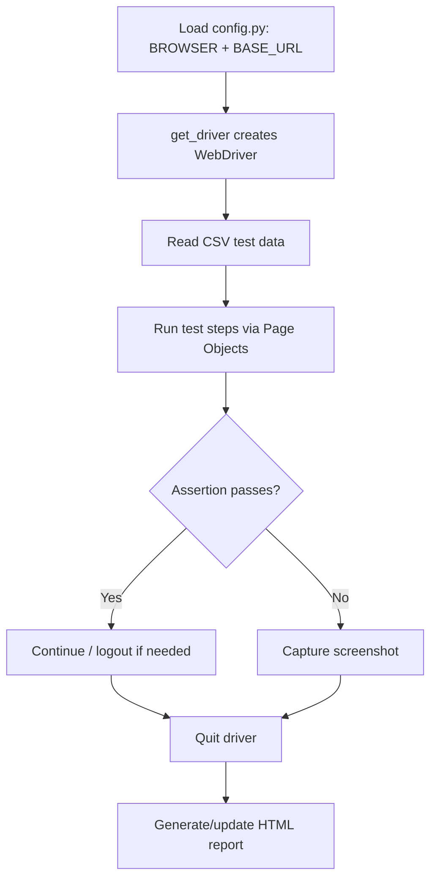

# Selenium Python Automation Framework
## Capstone Assignment 2 — Project Documentation

**Framework:** Selenium WebDriver + Unittest + PyTest + Page Object Model (POM)
**Application Under Test:** [https://automationexercise.com](https://automationexercise.com)
**Features Automated:** User Login, Product Search

---

## 1. Objective

To design and implement a Selenium-based Python automation framework that
automates the **Login** and **Product Search** workflows of an e-commerce
application, using:

- Page Object Model (POM) for maintainable UI interaction code
- Both `unittest` and `pytest` as test runners
- CSV-driven test data (data-driven testing)
- Automatic screenshot capture on test failure
- HTML test execution reports

---

## 2. Technology Stack

| Component            | Tool / Library                     |
|-----------------------|-------------------------------------|
| Programming language   | Python 3.12                        |
| Browser automation     | Selenium WebDriver 4.x             |
| Driver management      | `webdriver-manager`                |
| Test runner (1)         | `unittest` (Python standard library) |
| Test runner (2)         | `pytest`                           |
| HTML reporting          | `pytest-html`                      |
| Test data format        | CSV                                |
| Design pattern           | Page Object Model (POM)            |

---

## 3. Project Structure

```
selenium_framework_basic/
├── config.py                   # Browser choice + base URL + driver creation
├── pages/                      # Page Object Model classes
│   ├── home_page.py
│   ├── login_page.py
│   └── search_page.py
├── testdata/                   # CSV-driven test data
│   ├── login_data.csv
│   └── search_data.csv
├── tests/
│   ├── test_login_unittest.py  # unittest suite
│   ├── test_login_pytest.py    # pytest suite (login)
│   └── test_search_pytest.py   # pytest suite (search)
├── conftest.py                 # pytest fixture + failure-screenshot hook
├── pytest.ini                  # pytest configuration
├── screenshots/                # auto-generated on test failure
├── reports/                    # auto-generated HTML report
├── requirements.txt
└── README.md
```

---

## 4. Configuration Management — `config.py`

All environment-level settings live in one file so nothing is hard-coded
inside the tests or page classes:

```python
BROWSER = "chrome"          # "chrome" or "firefox"
BASE_URL = "https://automationexercise.com"

def get_driver():
    if BROWSER.lower() == "chrome":
        driver = webdriver.Chrome(...)
    elif BROWSER.lower() == "firefox":
        driver = webdriver.Firefox(...)
    else:
        raise Exception("Invalid browser name.")
    driver.maximize_window()
    driver.implicitly_wait(10)
    return driver
```

- `get_driver()` is called once per test (in `setUp()` for unittest, and in
  the `driver` fixture for pytest), so every test starts with a fresh browser
  session.
- Switching the whole suite to Firefox is a one-line change (`BROWSER = "firefox"`),
  with no edits needed anywhere else.

---

## 5. Page Object Model (POM)

Each page of the application under test has its own class. A page class
owns two things only: **its locators** and **the actions a user can take on
that page**. Tests never contain a raw `By.XPATH` or `By.ID` — they only
call page methods.

### 5.1 `HomePage`

| Method                  | Purpose                                                                 |
|--------------------------|--------------------------------------------------------------------------|
| `go_to_login_page()`      | Navigates directly to `/login` (see §9.1 for why it's direct navigation, not a click) |
| `go_to_products_page()`   | Navigates directly to `/products`                                       |
| `is_logged_in()`          | Returns `True`/`False` by checking for the "Logged in as..." link       |
| `logout()`                | Clicks the Logout link                                                  |

### 5.2 `LoginPage`

| Method                  | Purpose                                            |
|--------------------------|-----------------------------------------------------|
| `login(email, password)` | Fills the login form and submits it                |
| `get_error_message()`    | Returns the "incorrect" error text, if displayed   |

### 5.3 `SearchPage`

| Method                  | Purpose                                            |
|--------------------------|-----------------------------------------------------|
| `search_product(keyword)`| Types a keyword into the search box and submits    |
| `get_result_count()`     | Returns the number of product cards found           |

---

## 6. Test Data Management (CSV)

Test data is kept **outside** the test code, in CSV files under `testdata/`.
This is what makes the tests "data-driven" — adding a new test case means
adding a new row, not writing new code.

**`login_data.csv`**

| test_case          | email                          | password           | expected_result |
|---------------------|----------------------------------|----------------------|-------------------|
| valid_login          | *(real registered account)*      | *(real password)*    | success           |
| invalid_password     | *(same account)*                 | WrongPassword999     | failure           |
| invalid_email        | not_a_real_user@example.com      | SomePassword123      | failure           |

**`search_data.csv`**

| test_case            | search_term            | expect_results |
|------------------------|---------------------------|-------------------|
| search_dress            | Dress                      | yes               |
| search_tshirt            | T-Shirt                    | yes               |
| search_nonexistent       | zzznotarealproductzzz      | no                |

Both files are read with Python's built-in `csv.DictReader`, so each row
becomes a dictionary (e.g. `row["email"]`, `row["expected_result"]`).

---

## 7. Test Suites

### 7.1 Unittest Suite — `test_login_unittest.py`

A `unittest.TestCase` class with:

- `setUp()` — opens the browser and navigates to the base URL before every test.
- `tearDown()` — after every test, checks whether it failed and, if so,
  saves a screenshot; then always closes the browser.
- `test_navigate_to_login_page()` — verifies clicking through to `/login` works.
- `test_login_scenarios_from_csv()` — loops over every row in `login_data.csv`
  inside a `self.subTest(...)` block, so all rows run even if one fails, and
  each row is reported individually.

Run with:
```bash
python -m unittest tests.test_login_unittest -v
```

### 7.2 PyTest Suites — `test_login_pytest.py`, `test_search_pytest.py`

Plain functions instead of classes. Each test receives the `driver` fixture
(defined in `conftest.py`) as a parameter — pytest handles creating and
tearing down the browser automatically.

`@pytest.mark.parametrize` is used to run the same test function once per
CSV row:

```python
@pytest.mark.parametrize("row", login_data, ids=[r["test_case"] for r in login_data])
def test_login_scenarios(driver, row):
    ...
```

This produces one test result per CSV row in the pytest output
(e.g. `test_login_scenarios[valid_login]`, `test_login_scenarios[invalid_password]`).

Run with:
```bash
pytest                              # runs every test file under tests/
pytest tests/test_login_pytest.py   # just the login suite
```

---

## 8. Screenshot-on-Failure Mechanism

Two independent implementations exist, one per runner:

- **Unittest** (`tests/test_login_unittest.py → tearDown`): inspects the
  test's own result object after it finishes. If the current test is found
  in the failure/error list, a screenshot is saved to `screenshots/`.
- **PyTest** (`conftest.py → pytest_runtest_makereport`): a pytest hook that
  runs after every test call. If the call raised an exception, it grabs the
  `driver` fixture from that test and saves a screenshot.

Screenshots are named after the test (e.g. `test_login_scenarios_from_csv.png`)
and land in the `screenshots/` folder for the examiner/developer to review
without re-running anything.

---

## 9. Process Flow — What Happens When You Run a Test



**Step by step:**

1. `config.py` decides which browser to launch and what the base URL is.
2. `get_driver()` builds and returns a ready-to-use WebDriver instance
   (window maximized, implicit wait set).
3. The relevant CSV file is read into a list of dictionaries.
4. For each row, the test calls Page Object methods
   (`HomePage → LoginPage/SearchPage`) to drive the browser.
5. The test asserts the expected outcome (`success`/`failure`,
   `yes`/`no` results).
6. If the assertion fails, a screenshot is captured before the browser closes.
7. The driver is always closed (`driver.quit()`), pass or fail.
8. `pytest-html` compiles all results into `reports/report.html`.

### 9.1 Why Navigation Uses `driver.get()` Instead of `.click()`

During testing, `automationexercise.com` was found to occasionally show a
full-page Google ad interstitial (`#google_vignette` appended to the URL)
immediately after clicking a navigation link. This intercepted the click,
leaving the browser stuck on the ad instead of the intended page
(`/login` or `/products`), which then caused every downstream step
(e.g. `search_product` not found) to fail with `NoSuchElementException`.

**Fix applied:** `HomePage.go_to_login_page()` and `go_to_products_page()`
navigate directly via `driver.get(BASE_URL + "/login")` /
`driver.get(BASE_URL + "/products")` instead of clicking the nav link, with
a one-time automatic reload if the ad still appears on that direct load.
This removed the click-interception point entirely.

### 9.2 Cross-Runner `tearDown` Fix

`tests/test_login_unittest.py` can be executed two ways: directly via
`python -m unittest`, or indirectly because `pytest` auto-discovers
`unittest.TestCase` classes too. The two runners wrap the test result
object differently — under pytest, `self._outcome.result` does not expose
`.failures` / `.errors` the same way plain unittest does, which raised
`AttributeError: 'TestCaseFunction' object has no attribute 'failures'`
inside `tearDown()` even when the test itself had passed.

**Fix applied:** `tearDown()` now reads those attributes defensively with
`getattr(result, "failures", [])` / `getattr(result, "errors", [])`, so it
degrades gracefully (skipping the screenshot check) instead of crashing when
run under pytest, while still working exactly as before under plain
`unittest`.

---

## 10. HTML Reporting

`pytest.ini` configures every `pytest` run to automatically generate a
report:

```ini
[pytest]
testpaths = tests
addopts = -v --html=reports/report.html --self-contained-html
```

After running `pytest`, open `reports/report.html` in any browser to see:

- Pass/fail status for every test and every parametrized CSV row
- Duration of each test
- Full stack trace for any failure
- Environment metadata (Python version, platform, installed plugins)

---

## 11. How to Run This Project

```bash
# 1. Create and activate a virtual environment
python -m venv venv
venv\Scripts\activate        # Windows
source venv/bin/activate     # macOS/Linux

# 2. Install dependencies
pip install -r requirements.txt

# 3. Add a real registered login to testdata/login_data.csv
#    (replace the 'valid_login' row's email/password)

# 4. Run the unittest suite
python -m unittest tests.test_login_unittest -v

# 5. Run the full pytest suite (also re-runs the unittest file automatically)
pytest

# 6. View the HTML report
#    Open reports/report.html in a browser

# 7. Check screenshots/ for any failed test's screenshot
```

---

## 12. Test Case Summary

| # | Test Case              | Runner   | Data Source        | Expected Outcome |
|---|--------------------------|-----------|-----------------------|---------------------|
| 1 | Navigate to login page    | Both      | —                      | `/login` URL loads   |
| 2 | Valid login                | Both      | login_data.csv         | Login succeeds        |
| 3 | Invalid password            | Both      | login_data.csv         | Login fails            |
| 4 | Invalid email                | Both      | login_data.csv         | Login fails            |
| 5 | Navigate to products page     | PyTest    | —                      | `/products` URL loads  |
| 6 | Search — existing product ("Dress") | PyTest | search_data.csv    | Results returned        |
| 7 | Search — existing product ("T-Shirt") | PyTest | search_data.csv  | Results returned         |
| 8 | Search — non-existent product  | PyTest    | search_data.csv        | No results returned      |

---

## 13. Possible Future Enhancements

- Replace `time.sleep()` calls with `WebDriverWait` + `expected_conditions`
  for faster, more reliable waits.
- Move `BROWSER`/`BASE_URL` into a `config.ini` file read via `configparser`,
  for a cleaner separation between code and environment settings.
- Embed failure screenshots directly inside the `pytest-html` report
  (currently they're saved to a separate folder).
- Add a `BasePage` class to share common Selenium calls across all page
  objects and reduce duplication.
- Extend the same POM structure to cover the checkout/cart flow.

---

*Document generated as part of Capstone Assignment 2: Selenium Python
Framework Development (Unittest + PyTest + POM).*